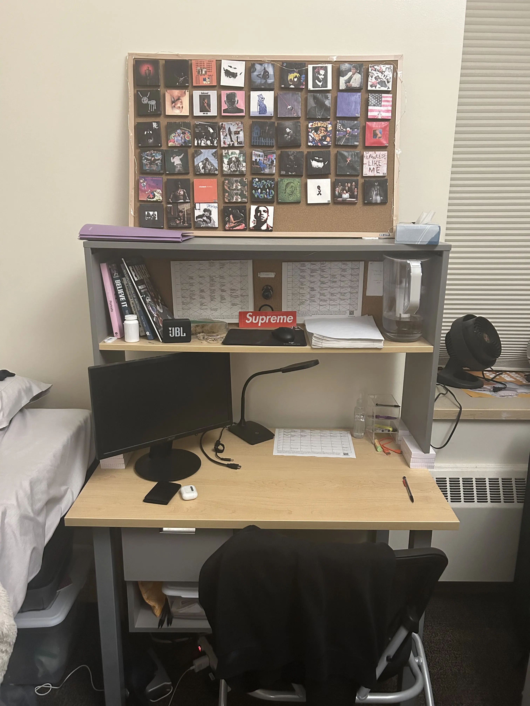

# [nikhilchinchalkar.com](https://nikhilchinchalkar.com)

> Hi, I'm Nikhil Chinchalkar. I'm a data scientist, an economist, a computer scientist, and an artist. This is a model of my desk.

## Background

The desk that's displayed on the site isn't actually my current desk--I built the initial version of the site in Spring 2025, so the model represents the desk I had during my sophomore year in college. In case you're curious, the desk actually looked like this:

What my desk looked like on April 8th, 2025. You might recognize some elements from t   he website.

I use [Blender](https://www.blender.org/) (4.1) to render the model that underlies the website, and the website itself is built with vanilla HTML and CSS, alongside Typescript for interactive elements.

While the model and code are my own, my page is inspired by [drakerelated.com](https://drakerelated.com/), the website for the rapper [Drake](https://en.wikipedia.org/wiki/Drake_(musician)#).

---

##### All content written, coded, and arranged by Nikhil Chinchalkar.

##### No Generative AI was used in the making of this project.